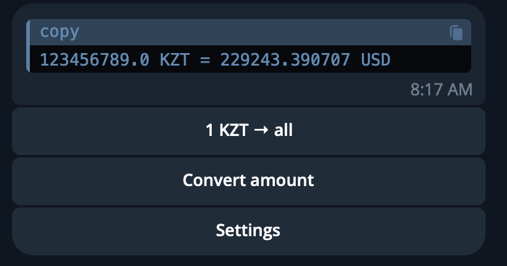
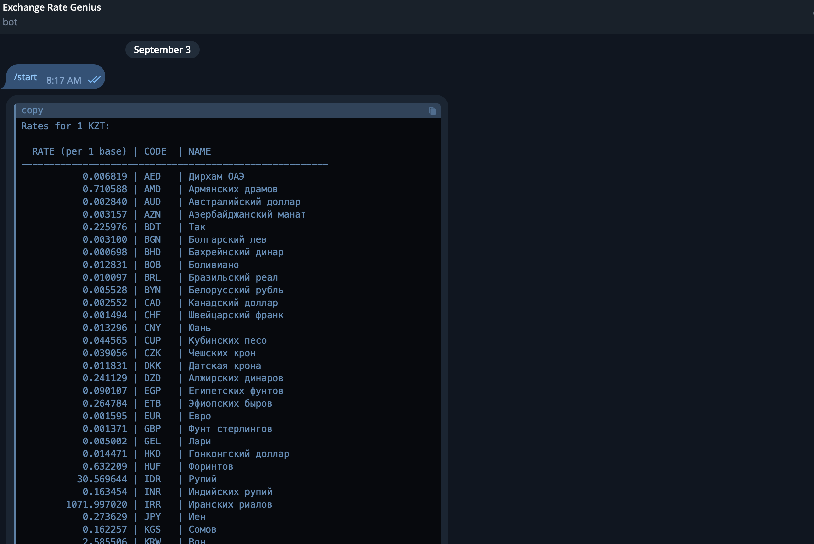
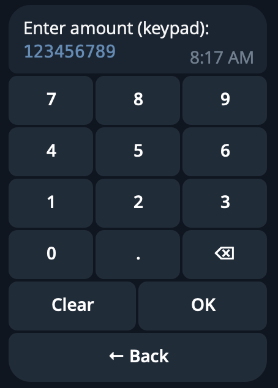

<div align="center">

# 🤖 Currency Exchange Bot

**A button-only Telegram bot for live currency rates and conversions — no typing, no commands to memorise.**


<br />

### ⚡ Try it right now — no setup

[](https://t.me/currenvy_bot_for_demo_bot)

*Press Start, pick a language, and you're converting currencies in under 15 seconds.*

</div>

---

## What it does

New users walk through a friendly onboarding: **language → data source → base currency**, then land in a two-button main menu:

- **1 BASE → all** — a clean, monospace-aligned table of your base currency against every other, sortable by code, name, or rate.
- **Convert amount** — pick a target currency and enter the amount on an inline numeric keypad. No free-text input anywhere.

```
┌──────────────────────────────┐
│  💱 1 USD → all              │
│                              │
│  EUR   European Euro   0.92  │
│  GBP   British Pound   0.78  │
│  KZT   Kazakh Tenge  478.11  │
│  RUB   Russian Ruble  87.45  │
│  ...                         │
│                              │
│  [Sort: rate ▾]  [⚙ Settings]│
└──────────────────────────────┘
```

Everything is **persistent**: language, data source (CBR / currencylayer API), and base currency survive bot restarts and are editable any time in Settings.

---

## ✨ Highlights

- 🧭 **Zero-typing UX** — the entire flow runs on inline buttons, including a numeric keypad calculator
- 🌍 **Multilingual** — English / Russian interface, switchable on the fly
- 🔀 **Dual data sources** — Central Bank of Russia (scraped with BeautifulSoup) or currencylayer API cross-rates, user's choice
- 📊 **Readable tables** — aligned monospace output with sorting (code / name / rate)
- 💾 **Persistence** — user preferences stored via `PicklePersistence`, no database required
- 🔐 **Secure config** — secrets in `.env` (`BOT_TOKEN`, `CURRENCYLAYER_API_KEY`), never in code
- 🚀 **Deploy anywhere** — Heroku / Railway / Render / any VPS; `Procfile` included

---

## 🗂 Structure

```
src/
  APIRate.py     # currencylayer cross-rates for an arbitrary base
  BotMain.py     # button-only flow, i18n, persistence, keypad calculator
  WEBScrappa.py  # CBR rates via BeautifulSoup
  config.py      # loads secrets from .env
requirements.txt
Procfile | runtime.txt   # optional, for Heroku-style deploys
```

---

## ⚙️ Run your own instance

```bash
python3 -m venv .venv && source .venv/bin/activate
pip install -r requirements.txt
cp .env.example .env   # fill in your tokens
python src/BotMain.py
```

`.env`:

```env
BOT_TOKEN=YOUR_TELEGRAM_BOT_TOKEN
CURRENCYLAYER_API_KEY=YOUR_CURRENCYLAYER_API_KEY
```

---

## 🧪 The flow

1. `/start` → choose language
2. Choose source: **CBR** or **currencylayer**
3. Choose base currency (paginated list)
4. Main menu:
   - **1 BASE → all** → view & sort the table
   - **Convert amount** → pick target → keypad → OK
   - **Settings** → change language / source / base at any time

---

## 🖼 Screenshots

<div align="center">
  
  
  
</div>

---

## 🔐 Notes

- Rotate any previously exposed keys or tokens.
- Respect currencylayer free-tier limits.
- The CBR scraper may need maintenance if the bank's markup changes.

---

## 📜 License

[GNU Affero General Public License v3 (AGPLv3)](https://www.gnu.org/licenses/agpl-3.0.html)

- ✅ Share and showcase code freely.
- ✅ Others may learn and contribute.
- ❌ No one can take it private, build a SaaS on top, and profit without open-sourcing their changes.

---

<div align="center">

Built by **[Igor Vuta](https://github.com/igor-vuta)** · [Portfolio](https://igor-vuta.github.io/portfolio/) · [LinkedIn](https://www.linkedin.com/in/igor-vuta-b88017390)

</div>
